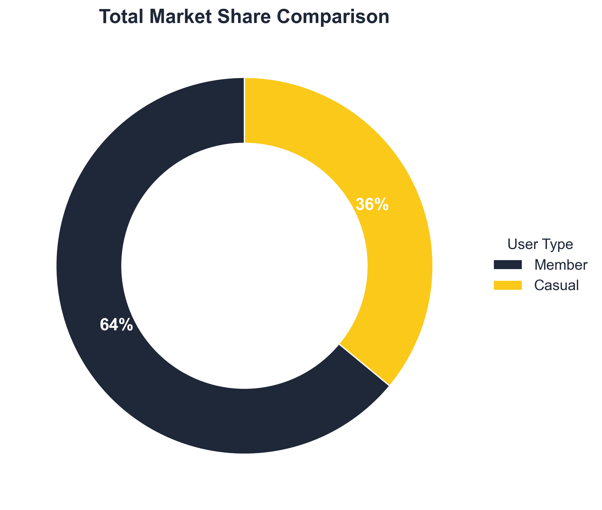
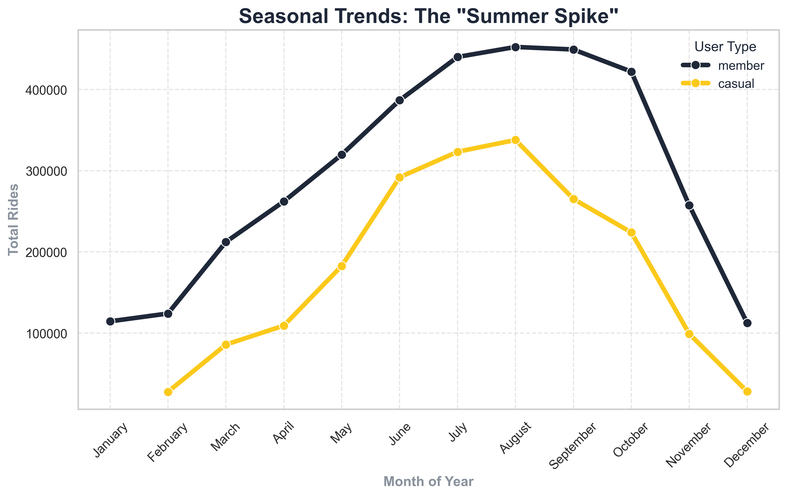
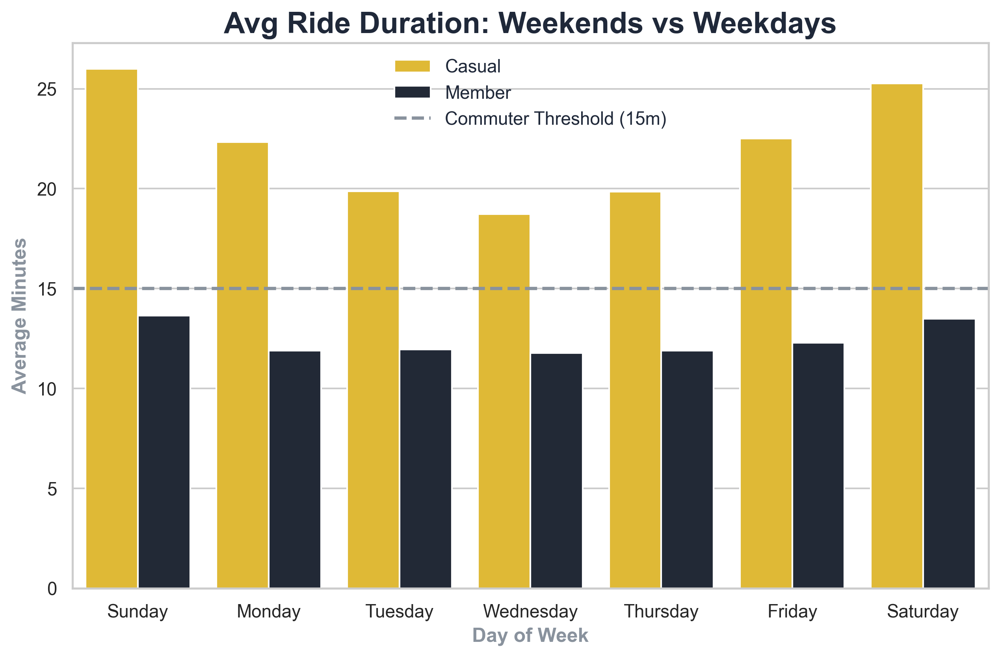

# 🚴 Cyclistic Bike-Share Analysis (Google Capstone)

> 📢 **Executive Presentation:**
> Looking for the high-level business strategy?
> 👉 [**Download the Strategic Slide Deck (PDF)**](04_Presentation/Cyclistic_Strategy_Presentation.pdf)

## 📌 1. Introduction
* **Project:** Google Data Analytics Professional Certificate - Capstone Project.
* **Role:** Junior Data Analyst at Cyclistic, a bike-share company in Chicago.
* **Goal:** Design marketing strategies to convert casual riders into annual members.

## ❓ 2. Business Task (The "Ask" Phase)
The director of marketing, **Lily Moreno**, believes the company’s future success depends on maximizing the number of annual memberships. Therefore, my team wants to understand how casual riders and annual members use Cyclistic bikes differently.

**Primary Question:**
* How do annual members and casual riders use Cyclistic bikes differently?

**Key Stakeholders:**
* **Lily Moreno:** Director of Marketing.
* **Cyclistic Executive Team:** Detail-oriented executive team responsible for approval.

## 📂 3. Data Source (The "Prepare" Phase)
* **Source:** Public data provided by **Motivate International Inc.** (Divvy Trip Data).
* **Format:** 12 Monthly CSV files containing ride data (Ride ID, timestamps, station info, user type).
* **License:** [Data License Agreement](https://ride.divvybikes.com/data-license-agreement).
* *Note: Data privacy is protected; no personal user information is available.*

## 🛠️ 4. Tools Used
* **SQL Server:** For Data Cleaning, Unioning (merging 12 months), and Analysis.
* **Python (Pandas & Seaborn):** For Statistical Analysis and Data Visualization.
* **Canva:** For Executive Presentation Design.

## 📊 5. Key Insights (The "Analyze" Phase)
Through SQL analysis and Python visualization, two distinct user profiles emerged:

### 🎨 Visualizations & Python Analysis
*Generated using Python (Pandas/Seaborn) to ensure brand consistency.*

#### 1. Market Share (The Opportunity)

> **Insight:** Casual riders represent **36%** of our user base. This is a massive pool of potential conversions already familiar with our brand.

#### 2. Seasonality (The "Summer Spike")

> **Insight:** Casual riders are "fair-weather" users. Marketing campaigns should launch in **early May** to capture the rising wave before the summer peak.

#### 3. Riding Habits (Weekends vs. Weekdays)

> **Insight:** Casuals ride **2x longer** on weekends. They use bikes for leisure, while Members use them for efficient commuting.

### 👤 The "Efficient Commuter" (Annual Members)
* **Routine:** Consistent usage Mon-Fri with minimal daily variance.
* **Duration:** Short, flat travel times (**~12-13 mins**) indicating A-to-B utility trips.
* **Consistency:** **Low Standard Deviation (31.29)**, mathematically proving highly predictable behavior.
* **Seasonality:** Maintains a "base load" of activity even in winter (necessity-based travel).

### 🌍 The "Weekend Explorer" (Casual Riders)
* **Routine:** Usage spikes dramatically on weekends (Sat/Sun).
* **Duration:** Rides are ~2x longer (**~26 mins**), confirming leisure/recreational intent.
* **Consistency:** **High Standard Deviation (81.42)**, proving chaotic/unstructured usage patterns.
* **Seasonality:** Activity drops by ~92% in winter (fair-weather dependence).

## 🚀 6. Strategic Recommendations (The "Act" Phase)
Based on the data analysis, I propose the following strategies to convert casual riders:

1.  **The "Summer Pass":** Create a seasonal membership (June-Sept) to bridge the gap between single rides and the full annual commitment.
2.  **Weekend "Quest" Campaign:** Gamify the experience. Offer discounts on annual memberships to users who complete rides on 5 consecutive weekends.
3.  **Leisure Partnerships:** Place targeted ads at parks and beaches (high casual traffic), highlighting the cost-savings of membership for long leisure rides.

## 📈 7. Deliverables Status
- [x] 1. A clear statement of the business task.
- [x] 2. A description of all data sources used.
- [x] 3. Documentation of any cleaning or manipulation of data.
- [x] 4. A summary of analysis.
- [x] 5. Supporting visualizations and key findings.
- [x] 6. Top three recommendations.